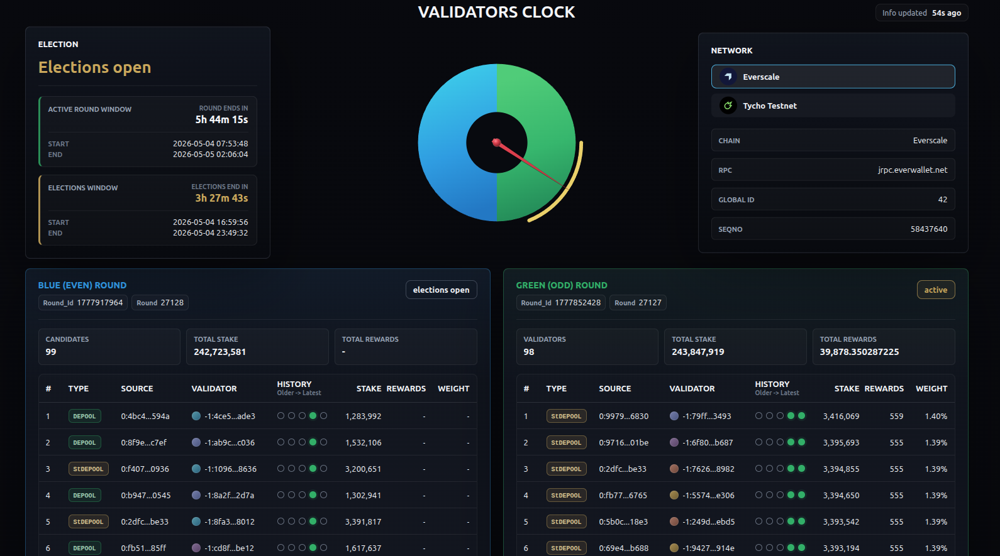

# Validators Clock

Validators Clock is a web dashboard for TVM blockchains. It currently supports
Everscale Mainnet and Tycho Testnet.

It shows validator rounds, election timing, candidates, stakes, rewards, wallet
types, and recent validator history.



## Run Locally

Install Rust if you do not have it:

```bash
curl --proto '=https' --tlsv1.2 -sSf https://sh.rustup.rs | sh
source "$HOME/.cargo/env"
```

Clone and run:

```bash
cd ~
git clone https://github.com/jouliene/validators_clock.git validators_clock
cd validators_clock
cargo run
```

Open:

```text
http://127.0.0.1:8787
```

Update local checkout:

```bash
cd ~/validators_clock
git pull --ff-only
cargo run
```

## Install In Production

Use an Ubuntu/systemd server. Point your domain DNS to the server first. Ports
80 and 443 must be open.

Install basic packages:

```bash
sudo apt update
sudo apt install -y build-essential pkg-config libssl-dev curl git
```

Clone and install:

```bash
cd ~
git clone https://github.com/jouliene/validators_clock.git validators_clock
cd validators_clock
./install.sh
```

For another production domain:

```bash
VALIDATORS_CLOCK_PUBLIC_URL=https://your-domain.example ./install.sh
```

The installer creates:

```text
~/.cargo/bin/validators_clock
~/.validators_clock/
/etc/systemd/system/validators-clock.service
```

It does not overwrite existing history, cache, ACME, TLS, or config files in
`~/.validators_clock`.

If Rust is not installed, `./install.sh` installs it automatically with rustup.

## Update Production

```bash
cd ~/validators_clock
git pull --ff-only origin main
./install.sh
```

## Check Production

```bash
sudo systemctl status validators-clock.service --no-pager
curl -sS https://validatorsclock.xyz/api/status
```

Logs:

```bash
sudo journalctl -u validators-clock.service -n 100 --no-pager
sudo journalctl -u validators-clock.service -f
```

## Runtime Data

Production data lives in:

```text
~/.validators_clock
```

Important files:

```text
validators_clock.production.json
validators_clock_history_everscale.json
validators_clock_history_tycho-testnet.json
validators_clock_validator_types.json
acme/
```
