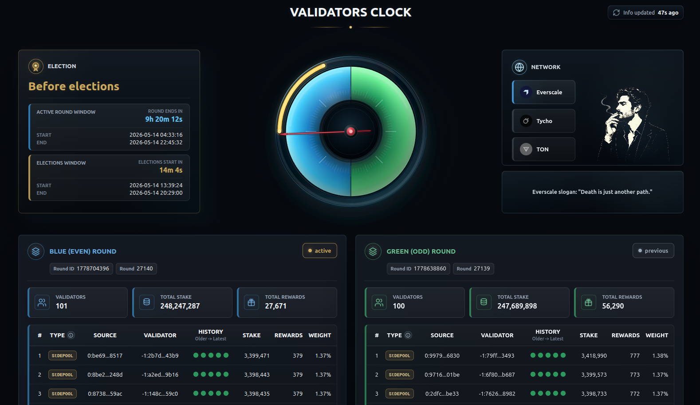

# Validator Clock

Web dashboard for Everscale, Tycho, and TON validator rounds, elections,
stakes, rewards, wallet types, and recent validator history.



## Run Locally

```bash
cd ~
git clone https://github.com/jouliene/validatorclock.git validatorclock
cd validatorclock
cargo run
```

Open:

```text
http://127.0.0.1:8787
```

The default TON config keeps TON Center as the primary RPC and uses Broxus as a
fallback. If you have a TON Center key, set it before starting the app:

```bash
export VALIDATORCLOCK_TONCENTER_API_KEY=your-key
```

If Rust is missing:

```bash
curl --proto '=https' --tlsv1.2 -sSf https://sh.rustup.rs | sh
source "$HOME/.cargo/env"
```

## Install On Ubuntu Server

Point DNS to the server first. Ports `80` and `443` must be open.

Install packages:

```bash
sudo apt update
sudo apt install -y build-essential pkg-config libssl-dev curl git
```

Clone, migrate existing production data if present, and install:

```bash
cd ~
git clone https://github.com/jouliene/validatorclock.git validatorclock
cd validatorclock
./scripts/migrate_to_validatorclock.sh
./install.sh
```

For another domain:

```bash
VALIDATORCLOCK_PUBLIC_URL=https://your-domain.example \
VALIDATORCLOCK_ACME_IDENTIFIER=your-domain.example \
VALIDATORCLOCK_ACME_EXTRA_IDENTIFIERS=www.your-domain.example \
./install.sh
```

`install.sh` checks Rust. If Rust is missing, it installs Rust with `rustup`.
If Rust is already managed by `rustup`, it updates Rust before building.

The script asks for `sudo` only for systemd work: installing the service file,
reloading systemd, enabling the service, and restarting the service.

## Update Production

```bash
cd ~/validatorclock
./update.sh
```

`update.sh` checks/updates Rust, runs:

```bash
git pull --ff-only origin main
```

then builds and installs the new binary. It does not recreate the systemd
service. For normal updates, it restarts the already-existing service without
sudo by stopping the current app process and letting systemd start it again.

`--ff-only` is intentional. It updates production only when Git can move
straight to the GitHub version. Plain `git pull` can create a merge commit on
the server if there are local changes.

## Check Production

```bash
sudo systemctl status validatorclock.service --no-pager
curl -I https://validatorclock.xyz/
curl -I https://validatorclock.xyz/api/status
curl -I https://www.validatorclock.xyz/
```

Logs:

```bash
sudo journalctl -u validatorclock.service -n 100 --no-pager
sudo journalctl -u validatorclock.service -f
```

## Files

Installed binary:

```text
~/.cargo/bin/validatorclock
```

Production data:

```text
~/.validatorclock
```

Important data files:

```text
validatorclock.production.json
validatorclock_history_everscale.json
validatorclock_history_tycho-testnet.json
validatorclock_history_ton.json
validatorclock_validator_types.json
acme/
```
