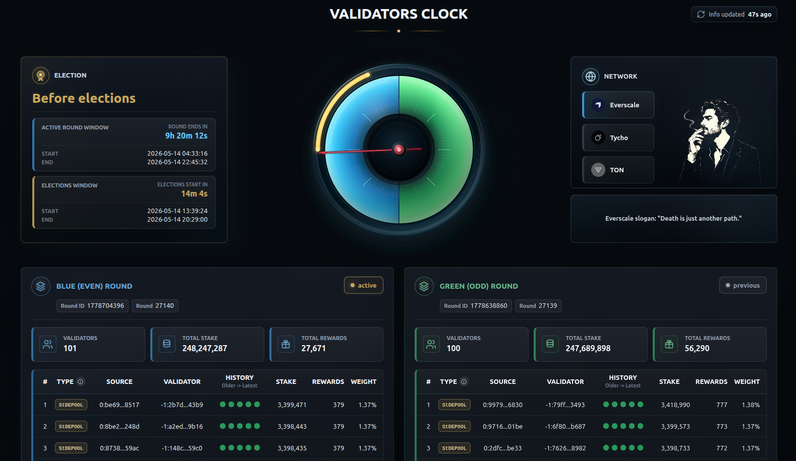

# Validator Clock

Web dashboard for Everscale, Tycho, and TON validator rounds, elections,
stakes, rewards, wallet types, and recent validator history.



## Run Locally

```bash
cd ~
git clone https://github.com/jouliene/validatorclock.git validatorclock
cd validatorclock
cargo run
```

Open:

```text
http://127.0.0.1:8787
```

The default TON config keeps TON Center as the primary RPC and uses Broxus as a
fallback. If you have a TON Center key, set it before starting the app:

```bash
export VALIDATORCLOCK_TONCENTER_API_KEY=your-key
```

Chain endpoints can be JRPC (`https://host`), TON Center
(`https://toncenter.com/api/v2/jsonRPC`), or GraphQL — any URL whose last path
segment is `graphql`, such as an Evercloud endpoint. The default Everscale
config uses the Evercloud GraphQL endpoint with `jrpc.everwallet.net` as a
fallback. Endpoints that authenticate with a bearer token instead of a project
id in the URL can read it from:

```bash
export VALIDATORCLOCK_GRAPHQL_API_KEY=your-key
```

If Rust is missing:

```bash
curl --proto '=https' --tlsv1.2 -sSf https://sh.rustup.rs | sh
source "$HOME/.cargo/env"
```

## Install On Ubuntu Server

Point DNS to the server first. Ports `80` and `443` must be open.

Install packages:

```bash
sudo apt update
sudo apt install -y build-essential pkg-config libssl-dev curl git
```

Clone, migrate existing production data if present, and install:

```bash
cd ~
git clone https://github.com/jouliene/validatorclock.git validatorclock
cd validatorclock
./scripts/migrate_to_validatorclock.sh
./install.sh
```

For another domain:

```bash
VALIDATORCLOCK_PUBLIC_URL=https://your-domain.example \
VALIDATORCLOCK_ACME_IDENTIFIER=your-domain.example \
VALIDATORCLOCK_ACME_EXTRA_IDENTIFIERS=www.your-domain.example \
./install.sh
```

`install.sh` checks Rust. If Rust is missing, it installs Rust with `rustup`.
If Rust is already managed by `rustup`, it updates Rust before building.

The script asks for `sudo` only for systemd work: installing the service file,
reloading systemd, enabling the service, and restarting the service.

## Update Production

```bash
cd ~/validatorclock
./update.sh
```

`update.sh` checks/updates Rust, runs:

```bash
git pull --ff-only origin main
```

then builds and installs the new binary. It does not recreate the systemd
service. For normal updates, it restarts the already-existing service without
sudo by stopping the current app process and letting systemd start it again.

`--ff-only` is intentional. It updates production only when Git can move
straight to the GitHub version. Plain `git pull` can create a merge commit on
the server if there are local changes.

## Visitor Stats

The footer of the main page shows aggregate traffic (today, last 30 days, all
time) and stays public. A password-protected page breaks the same traffic down
per IP address:

```text
https://validatorclock.xyz/stats
```

Each row shows the address, its country, city, and provider (resolved through
ip-api.com), visits today, visits over the last 30 days, visits all time, when
the address was last seen, and whether it is on the site right now. A visit is a
session from one address; a new visit starts after 30 minutes without activity,
and days are counted in UTC.

### Password

`/stats`, `/stats/app.js`, and `/stats/visitors` are behind HTTP Basic auth. Set
the password in the production config, which survives `install.sh` re-runs:

```json
"security": {
  "allowed_hosts": ["validatorclock.xyz", "www.validatorclock.xyz"],
  "stats_auth": {
    "username": "admin",
    "password": "your-long-random-password"
  }
}
```

Generate one with `openssl rand -base64 24`, keep the config file at mode `600`,
and restart the service. Instead of the config field the password can come from
the `VALIDATORCLOCK_STATS_PASSWORD` environment variable (set
`security.stats_auth.password_env` to read a different name), which suits a
systemd `EnvironmentFile`.

Without a password the page and its API return `404`, so a fresh install never
exposes visitor addresses by accident. The startup log says which of the three
states is active. Setting `security.stats_auth.enabled` to `false` makes the
page public again.

### Storage

Visitor addresses live in `validatorclock_visitors.json` next to the other state
files. Per-address day counters are kept for 31 days, records for addresses that
stop visiting are dropped after a year, and the store holds at most 5000
addresses (the least recently seen are evicted first).

## Check Production

```bash
sudo systemctl status validatorclock.service --no-pager
curl -I https://validatorclock.xyz/
curl -I https://validatorclock.xyz/api/status
curl -I https://www.validatorclock.xyz/
```

Logs:

```bash
sudo journalctl -u validatorclock.service -n 100 --no-pager
sudo journalctl -u validatorclock.service -f
```

## Files

Installed binary:

```text
~/.cargo/bin/validatorclock
```

Production data:

```text
~/.validatorclock
```

Important data files:

```text
validatorclock.production.json
validatorclock_history_everscale.json
validatorclock_history_tycho-testnet.json
validatorclock_history_ton.json
validatorclock_validator_types.json
validatorclock_visitors.json
acme/
```
